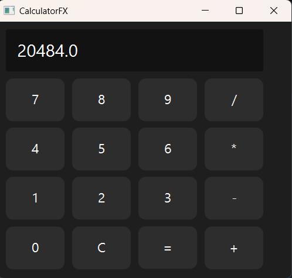

# CalculatorFX

Une calculatrice graphique développée en JavaFX.

## Fonctionnalités

- Addition
- Soustraction
- Multiplication
- Division
- Effacement (C)

## Technologies

- Java 17
- JavaFX
- CSS

## Capture

Projet réalisé dans le cadre d'un challenge JavaFX de 20 jours.

## Lancer le projet

```bash
javac Main.java
java Main

