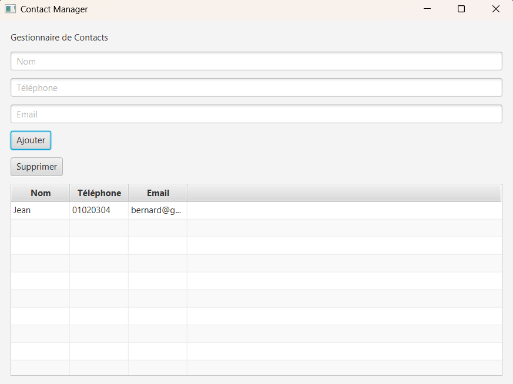

# Contact Manager JavaFX



## Description

Contact Manager est une application JavaFX permettant de gérer une liste de contacts.

L'utilisateur peut :

* Ajouter un contact
* Afficher les contacts
* Supprimer un contact

Les données sont affichées dans un tableau dynamique grâce au composant TableView.

---

## Technologies

* Java 17+
* JavaFX
* TableView
* ObservableList
* Programmation Orientée Objet

---

## Structure du projet

```text
src/
├── Main.java
└── Contact.java
```

---

## Fonctionnalités

### Ajouter un contact

Saisir :

* Nom
* Téléphone
* Email

Puis cliquer sur "Ajouter".

### Supprimer un contact

Sélectionner une ligne dans le tableau puis cliquer sur "Supprimer".

---

## Interface

Le projet contient :

* TextField
* Button
* Label
* TableView
* VBox

---

## Lancement

Compiler :

```bash
javac *.java
```

Exécuter :

```bash
java Main
```

---

## Compétences acquises

* Création d'interfaces JavaFX
* Gestion d'événements
* Utilisation de TableView
* Manipulation d'ObservableList
* Architecture orientée objet

---

## Améliorations possibles

* Modifier un contact
* Rechercher un contact
* Sauvegarder dans un fichier CSV
* Importer un fichier CSV
* Utiliser une base de données MySQL
* Ajouter du CSS JavaFX
* Ajouter une fenêtre de confirmation de suppression