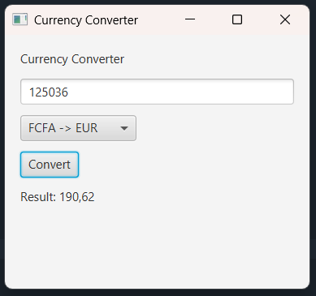

# Currency Converter - JavaFX

## Description

Currency Converter est une application graphique développée en JavaFX permettant de convertir rapidement des montants entre différentes devises.

Ce projet a été réalisé dans le cadre d'un apprentissage de JavaFX et des interfaces graphiques Java.

---

## Fonctionnalités

* Conversion EUR → USD
* Conversion USD → EUR
* Conversion FCFA → EUR
* Interface graphique simple et intuitive
* Validation des entrées utilisateur
* Affichage instantané du résultat

---

## Technologies utilisées

* Java 17+
* JavaFX
* VS Code ou IntelliJ IDEA

---

## Structure du projet

```text
CurrencyConverter/
│
└── src/
    └── Main.java
```

---

## Interface

L'application contient :

* Un champ de saisie du montant
* Une liste déroulante pour choisir le type de conversion
* Un bouton "Convert"
* Une zone d'affichage du résultat

---

## Conversions utilisées

| Conversion | Taux                |
| ---------- | ------------------- |
| EUR → USD  | 1.09                |
| USD → EUR  | 0.92                |
| FCFA → EUR | 655.96 FCFA = 1 EUR |

> Les taux sont fixes dans cette version et peuvent être mis à jour manuellement.

---

## Installation

### Prérequis

* Java JDK 17 ou supérieur
* JavaFX SDK
* VS Code avec l'extension Java Extension Pack

### Vérifier Java

```bash
java --version
```

```bash
javac --version
```

---

## Compilation

```bash
javac --module-path "PATH_TO_FX/lib" --add-modules javafx.controls Main.java
```

---

## Exécution

```bash
java --module-path "PATH_TO_FX/lib" --add-modules javafx.controls Main
```

Remplace `PATH_TO_FX` par le chemin réel de ton installation JavaFX.

Exemple Windows :

```bash
java --module-path "C:\javafx-sdk-24\lib" --add-modules javafx.controls Main
```

---

## Exemple d'utilisation

1. Entrer un montant
2. Sélectionner une conversion
3. Cliquer sur **Convert**
4. Consulter le résultat

Exemple :

```text
Montant : 100
Conversion : EUR -> USD

Résultat : 109.00
```

---

## Compétences acquises

* Création d'interfaces graphiques avec JavaFX
* Utilisation des composants JavaFX
* Gestion des événements utilisateur
* Manipulation des nombres et conversions
* Gestion des exceptions
* Organisation d'un projet Java

---

## Améliorations futures

* Taux de change en temps réel via API
* Historique des conversions
* Interface moderne avec CSS
* Conversion entre davantage de devises
* Support du mode sombre
* Sauvegarde des conversions

---

## Auteur

Projet réalisé dans le cadre d'un programme de pratique JavaFX sur 20 jours.

Jour 2 : Currency Converter
