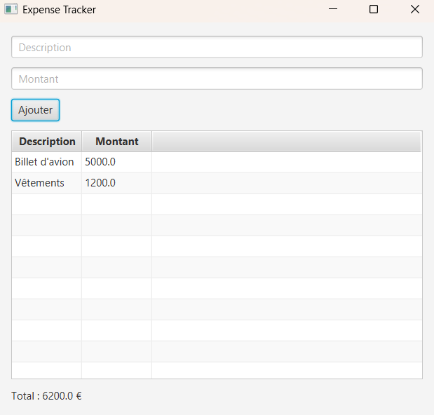

# Expense Tracker JavaFX


## Description

Expense Tracker est une application desktop développée avec JavaFX permettant de suivre les dépenses personnelles.

L'utilisateur peut :

* Ajouter une dépense
* Visualiser les dépenses dans un tableau
* Consulter le total des dépenses

---

## Technologies

* Java 17+
* JavaFX
* TableView
* ObservableList

---

## Fonctionnalités

### Ajouter une dépense

L'utilisateur renseigne :

* Description
* Montant

Puis clique sur "Ajouter".

---

### Afficher les dépenses

Toutes les dépenses sont affichées dans un tableau.

---

### Calcul automatique

Le total des dépenses est recalculé automatiquement après chaque ajout.

---

## Structure du projet

```text
ExpenseTracker/

├── src/
│   ├── Main.java
│   └── Expense.java
│
└── README.md
```

---

## Lancer le projet

Compiler :

```bash
javac *.java
```

Exécuter :

```bash
java Main
```

---

## Exemple d'utilisation

| Description | Montant |
| ----------- | ------- |
| Courses     | 50      |
| Transport   | 20      |
| Internet    | 30      |

Total : 100 €

---

## Compétences acquises

* JavaFX
* TableView
* ObservableList
* Gestion des événements
* Architecture orientée objet

---

## Améliorations futures

* Suppression d'une dépense
* Modification d'une dépense
* Sauvegarde dans un fichier CSV
* Graphiques de dépenses
* Base de données MySQL
* Dashboard statistique

---

Projet réalisé dans le cadre d'un parcours d'apprentissage JavaFX.


