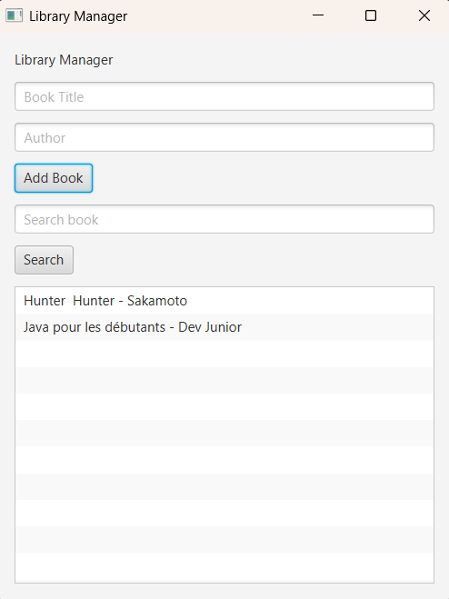

# Library Manager


## Description

Library Manager is a simple JavaFX desktop application that allows users to manage a small collection of books.

The application follows a basic MVC architecture and demonstrates JavaFX fundamentals.

---

## Features

* Add a new book
* Display all books
* Search books by title
* Simple JavaFX user interface
* MVC architecture

---

## Technologies

* Java 17+
* JavaFX
* MVC Pattern
* ObservableList

---

## Project Structure

```text
src/

model/
 └── Book.java

controller/
 └── LibraryController.java

view/
 └── LibraryApp.java
```

---

## How It Works

### Add Book

Enter:

* Book title
* Author name

Click:

```text
Add Book
```

The book appears in the list.

---

### Search Book

Enter a keyword:

```text
Java
```

Click:

```text
Search
```

Matching books are displayed.

---

## Concepts Practiced

* JavaFX Application
* Scene
* Stage
* VBox Layout
* TextField
* Button
* ListView
* Event Handling
* ObservableList
* MVC Architecture

---

## Future Improvements

* Delete book
* Update book
* Save to file
* Load from file
* Database integration
* TableView
* CSS Styling
* Dark Mode

---

## Author

JavaFX Learning Project
