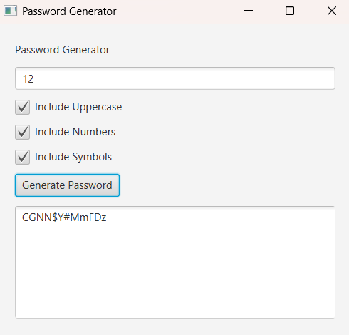

# Password Generator JavaFX

## Description

Password Generator is a simple JavaFX desktop application that generates secure passwords based on user preferences.

Users can choose:

* Password length
* Include uppercase letters
* Include numbers
* Include special symbols

The application then generates a random password.

---

## Technologies Used

* Java
* JavaFX
* Object-Oriented Programming

---

## Features

### Generate Password

Generate a random password.

### Password Length

Choose the desired password length.

### Uppercase Letters

Include uppercase characters.

### Numbers

Include digits from 0 to 9.

### Symbols

Include special characters.

---

## Project Structure

```text
PasswordGenerator/
│
├── src/
│   └── PasswordGeneratorApp.java
│
└── README.md
```

---

## Example

```text
Length: 12

✓ Uppercase
✓ Numbers
✓ Symbols

Generated Password:
A#9kLm2!Pq7@
```

---

## How to Run

Compile:

```bash
javac PasswordGeneratorApp.java
```

Run:

```bash
java PasswordGeneratorApp
```

---

## Skills Learned

* JavaFX basics
* Event handling
* CheckBox
* TextField
* TextArea
* Random number generation
* StringBuilder

---

## Future Improvements

* Copy to clipboard
* Password strength indicator
* Dark mode
* Save generated passwords
* Custom character sets

---

Created as part of a JavaFX learning challenge.
