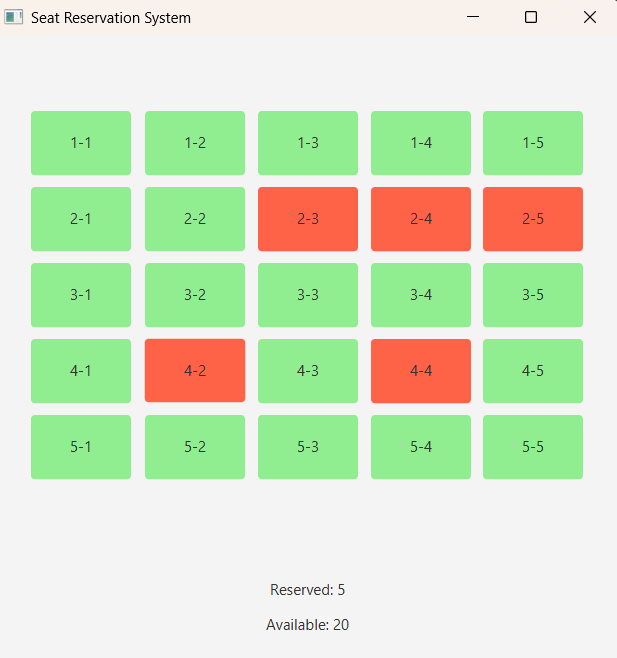

# Seat Reservation System


## Description

Seat Reservation System is a simple JavaFX desktop application that simulates a seat reservation interface.

Users can click on seats to reserve or cancel reservations.

The application automatically updates the number of reserved and available seats.

---

## Features

* Interactive seat grid
* Reserve a seat
* Cancel a reservation
* Real-time statistics
* Simple and intuitive interface

---

## Technologies Used

* Java
* JavaFX
* GridPane
* Event Handling

---

## Project Structure

```text
SeatReservationSystem/
│
├── src/
│   └── Main.java
│
└── README.md
```

---

## How It Works

### Available Seat

Green seat:

```text
Available
```

### Reserved Seat

Red seat:

```text
Reserved
```

Clicking a seat changes its status.

---

## Learning Objectives

This project helps practice:

* JavaFX fundamentals
* Layout management with GridPane
* Event handling
* Dynamic UI updates
* Java object-oriented programming

---

## Possible Improvements

* Add customer names
* Save reservations to a file
* Add seat categories (VIP, Standard)
* Connect to a database
* Add login authentication
* Create a cinema reservation system

---

## Run the Project

Compile and run using JavaFX:

```bash
javac Main.java
java Main
```

---

## Author

Created as part of a JavaFX learning journey.
