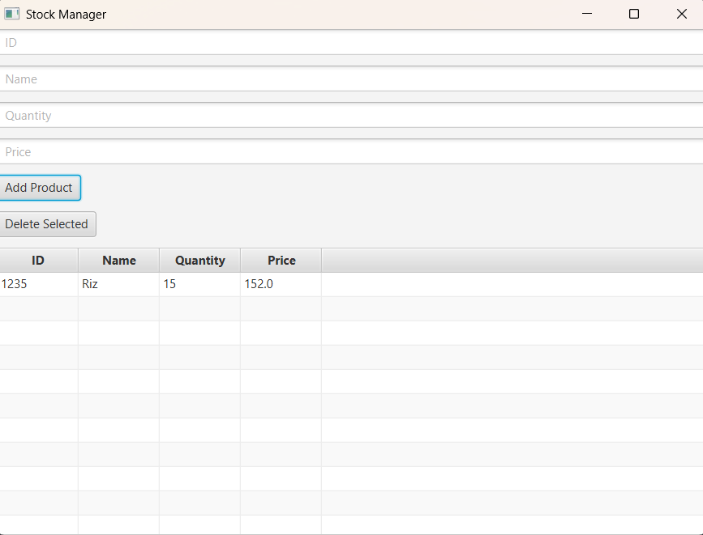

# Stock Manager FX


## Description

Stock Manager FX est une application desktop développée avec JavaFX permettant de gérer un inventaire de produits.

L'application permet :

* Ajouter un produit
* Afficher les produits
* Supprimer un produit
* Sauvegarder automatiquement les données
* Charger les données au démarrage

---

## Technologies

* Java 17+
* JavaFX
* TableView
* File I/O (CSV)
* Programmation Orientée Objet

---

## Fonctionnalités

### Ajouter un produit

Chaque produit contient :

* ID
* Nom
* Quantité
* Prix

### Afficher les produits

Tous les produits sont affichés dans un TableView.

### Supprimer un produit

Sélectionner une ligne puis cliquer sur "Delete Selected".

### Sauvegarde automatique

Chaque modification est enregistrée dans :

```text
stock.csv
```

---

## Structure

```text
src/
├── Main.java
├── Product.java
├── ProductManager.java
└── stock.csv
```

---

## Lancer le projet

### Compilation

```bash
javac *.java
```

### Exécution

```bash
java Main
```

---

## Améliorations futures

* Recherche de produit
* Modification produit
* Dashboard statistiques
* Alertes stock faible
* Gestion catégories
* Base de données MySQL
* Authentification utilisateur
* Export PDF

---

## Compétences acquises

* JavaFX
* TableView
* ObservableList
* CRUD
* Sauvegarde CSV
* Gestion d'événements
* Architecture simple MVC

Projet réalisé dans le cadre d'un parcours d'apprentissage JavaFX.
