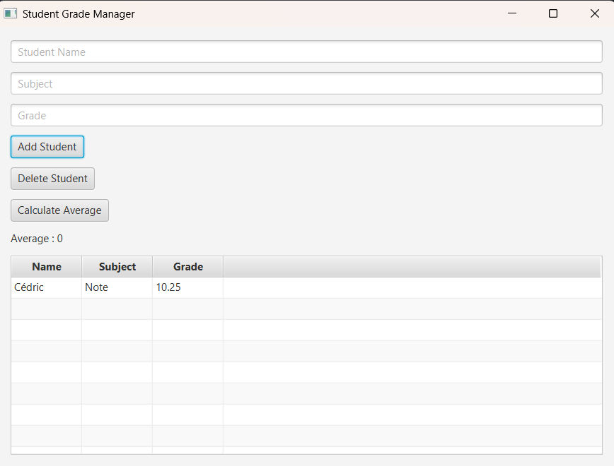

# Student Grade Manager


## Description

Student Grade Manager is a simple JavaFX desktop application that allows users to manage student grades.

The application demonstrates:

* JavaFX GUI development
* Object-Oriented Programming
* CRUD operations
* TableView usage
* ObservableList management

---

## Features

### Add Student

Users can add:

* Student Name
* Subject
* Grade

### View Students

All students are displayed in a TableView.

### Delete Student

Remove a selected student.

### Calculate Average

Calculate the average grade of all students.

---

## Technologies

* Java 17+
* JavaFX
* Object-Oriented Programming

---

## Project Structure

```text
src/
├── Main.java
├── Student.java
└── StudentController.java
```

---

## How to Run

Compile:

```bash
javac *.java
```

Run:

```bash
java Main
```

---

## Skills Learned

* JavaFX Components
* Event Handling
* TableView
* ObservableList
* CRUD Basics
* MVC Concepts

---

## Future Improvements

* Edit Student
* Search Student
* Save Data to File
* MySQL Database Integration
* JavaFX CSS Styling
* Dashboard Statistics

---

Created as part of a JavaFX learning challenge.
