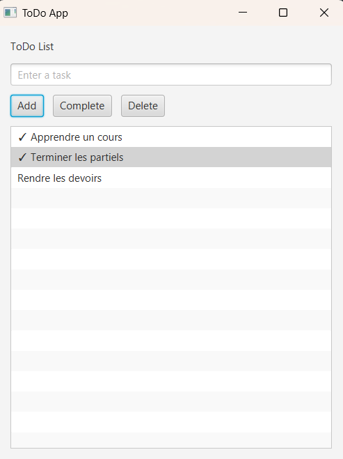

# ToDo App JavaFX

## Description

ToDo App is a simple JavaFX desktop application that allows users to manage their daily tasks.

This project is designed for beginners learning JavaFX and graphical user interface development.

---

## Features

* Add a task
* Display tasks
* Mark a task as completed
* Delete a task
* User-friendly graphical interface

---

## Technologies

* Java
* JavaFX
* ObservableList
* ListView
* Event Handling

---

## Project Structure

```text
TodoApp/
│
├── src/
│   └── Main.java
│
└── README.md
```

---

## How It Works

1. Enter a task in the text field.
2. Click **Add**.
3. Select a task from the list.
4. Click **Complete** to mark it as done.
5. Click **Delete** to remove it.

---

## Concepts Learned

* JavaFX Application
* Scene and Stage
* Layouts (VBox, HBox)
* Buttons
* TextField
* ListView
* ObservableList
* Event Handling

---

## Future Improvements

* Save tasks to a file
* Load tasks automatically
* Add task priorities
* Add due dates
* Modern CSS styling
* SQLite database integration

---

## Screenshot

You can add a screenshot of the application here after running it.

---

## Author

JavaFX Learning Project - Day 4
